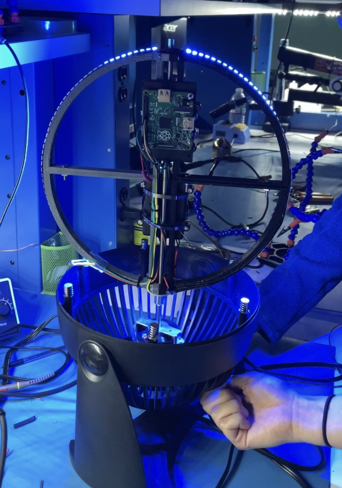
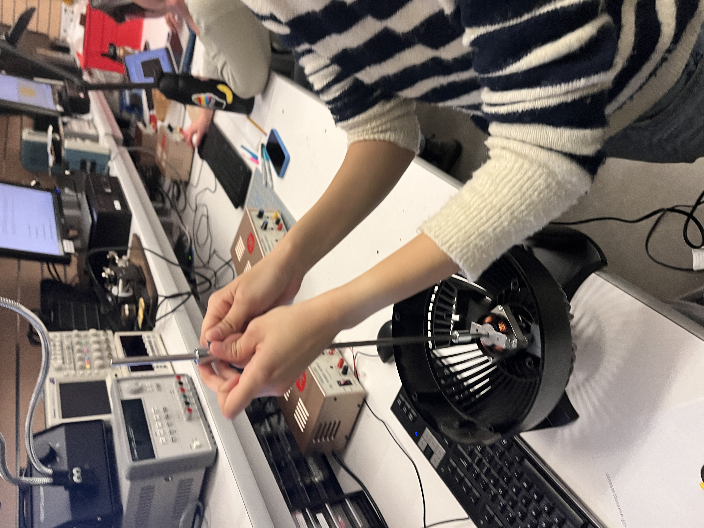
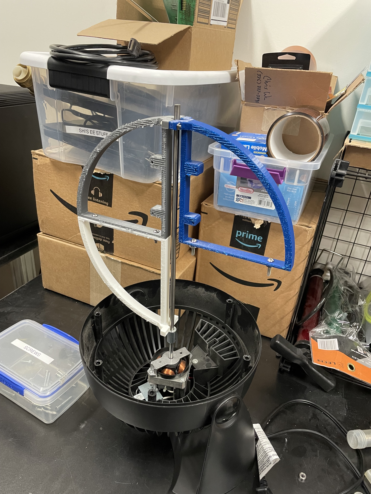
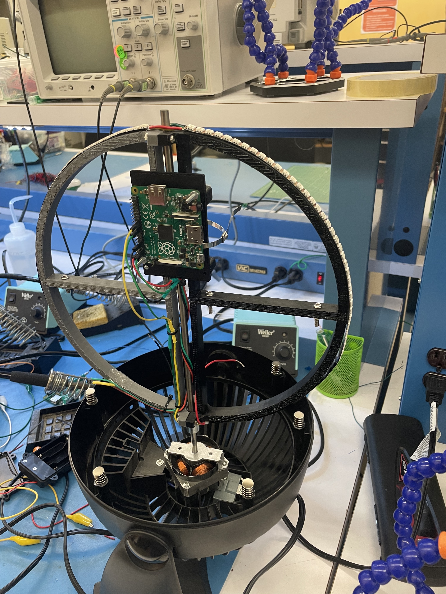

<h1> :earth_asia:  Persistence of Vision (POV) Display  :earth_asia: </h1>

<h1> Team Members </h1>
- Didi Kamalova  
- Naomi Mo  
- Aanya Tashfeen  

<h1> Project Description </h1>
We created a spherical persistence of vision (POV) LED Display that works by spinning a circular array of LEDs and relies on our eyes' natural “refresh rates” to create the illusion of a solid image on a sphere. Equipped with an LED strip, a hall sensor, 3 battery packs and framed in a desk fan, it creates patterns upon reacting to magnets spaced out across the circular base.

<h1> Member Contribution </h1>
- Aanya: graphics code, 3D modeling, ....  
- Didi: led driver code, soldering, cable management  
- Naomi: hall sensor code, graphics code, ....  

<h1> References </h1>
- POV Globe Video and GitHub Repo: https://www.youtube.com/watch?v=E4yqSw38R_Q&t=178s  
- Julie's LED strip driver code  
- Pat's hall effect sensor code  
- Math libraries from CS107E Repo  

<h1> Self-Evaluation </h1>

 We created a fully functioning prototype of a spherical LED Display that allows for free spinning, coded an LED strip driver, integrated hall sensor interrupts and successfully projected a soccerball pattern on the sphere. While we have not been able to project a spherical image of the globe as was initally planned, we were able to complete all other goals that we have set for this project! 

One of the most memorable moments of this past week is definitely the moment we stumbled upon an interesting bug: the motor on our fan was generating a magnetic field which would induce current interfering with our circuitry, displaying weird artifacts and an undefined behavior on the strip. In attempts to block/redirect the magnetic field, we created a shield made out of thin stainless steel plates layered onto one another. However, this ended up trapping the heat and ultimately overheated the motor, making it no longer functionable... at 12:30AM, the night before the demo. Thankfully, we were able to find a different fan (shoutout to Frances!) to reinstall our ring onto a new fan 15 minutes before the demo session.

**Aanya**: ... 

**Didi**: Understanding how to drive an LED strip was not trivial; however, I felt comfortable navigating the datasheet for the APA102 communication protocol in the absense of reliable information! What helped me the most was using the logic analyzer to debug and experiment with data frames bit by bit (one of many useful skills learned in class!). I'm also happy with the electrical assembly of the display! I focused on placing our wires and circuit components in way that would look neat & help wires remain static during the rotation of the ring - mission accomplished!

**Naomi**: Implementing the hall sensor was relatively simple, as it only required three electrical connections, and I had Pat's hall sensor code to work with from the start! I built upon the existing code by adding interrupts so that sensor readings could be obtained while the Pi drove the LED strip; I also added debouncing so that magnet events would not be registered continuously in a magnetic field, and would instead only be registered by a change of state. After implementing the hall driver, I moved onto mechanical/electrical assembly; the initial stages of experimenting with the fan motor in Room 36 with Aanya were quite fun. It was also interesting to work through the logistics of operating the Pi independently of the computer (I have a newfound appreication for the bootloader).

  

  
  
  

More images provided in the "media" folder!

NOTE ABOUT CODE ORGANIZATION:
The simple code that we ran during demo day is under main, but more intricate implementations involving round trip time and displaying image arrays (the globe, soccer ball, and checkerboard) are under globe.c and RTTmeasure.c. We unfortunately did not get these to be fully optimized and integrated by the end of the project deadline, although we made the soccer ball display operational after our demonstration.
